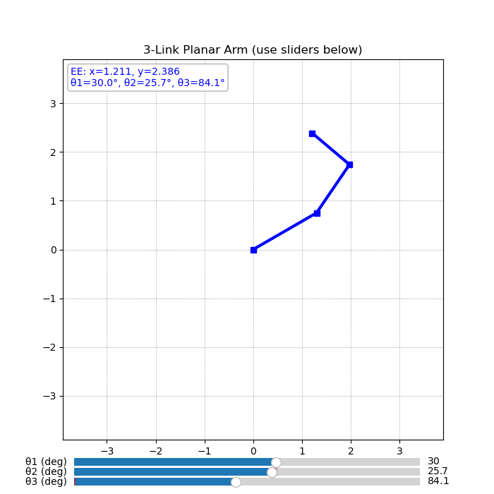
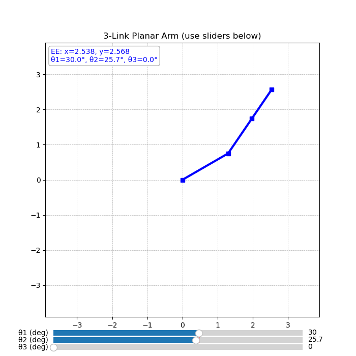

# 2D 2 LINKS ROBOTICS PROJECT
I understood the use of Forward Kinematics algorithm to compute the end-effector position of a robotic arm by passing in the initial angles θ1 and θ2. I also learnt about the plt.subplot(1, 1, 1) which creates a plotting area within the plotting window. The parameters can be adjusted to create 2,3 or more plots horizontally or vertically. Like a table of plots containing figures within. I also understood the conventions for different markers used in drawing the joints of the link line. Below are some examples of markers:
| **Marker code**|**Description** |**Example Appearance** |
|-----------------|----------------|----------------------|
|`"o"`| Circle | ○ |
|`"s"`| Square | ■ |
|`"D"`| Diamond | ◆ |
|`"d"`| Thin diamond | ◇ |
|`"x"`| `X` shape | ✕ |
|`"p"`| Pentagon | ⬟ |
|`"h"`| Hexagon | ⬢ |
|`"*"`| Star | ★ |
## CODE TRIALS/IMPROVEMENTS:
1. Instead of a slider mechanism, I explored animation of the robot arm. This is better to understand the limits of the robot movement without having to manually input the degrees. However, for the purpose of understanding the concepts of Forward Kinematics, inputting the degrees is fine.
2. I explored the use of subplots in the plotting window to create 2 figures. One representing the Robot arm and the other representing the trajectory as seen in fig. 1

   
  <em>Figure 1: Robot Arm and Trajectory</em>

3. I changed the slider limits from -180 to 180  to 0 to 360 trying to make it more intuitive. However, I discovered that the former is a convention and the latter allows the 2nd robot link collide in unrealistic ways with the first link. So it's better leaving it as it is.  
4. I extended the 2 links planar arm to 3 links planar arm by adding an extra length link, theta angle, and increasing the variables in the functions and code by an extra joint. Upon running the 3 links robot, I came across a problem not found in 2 links. While link 2 cannot cross over link 1, and link 3 cannot cross over link 2 in it's full range of motion (-180 to 180), link 3 <em>can</em> cross over link 1 when theta2 is being changed as seen in fig 2.  

   
  <em>Figure 2: Unrealistic collision between Link 1 and Link 3</em>

I Implemented a code that checks for segment intersection as seen in fig. 3. The functions to run the check are defined at the start of the document just under the forward kinematics function.   

   
  <em>Figure 3: Code to check for segment intersection</em>

Under the update function, the code changes the colour of the links to red (shown in fig. 5) when self-collision is detected as well as displays an error message. This was implemented as seen in fig. 4.

   
  <em>Figure 4: Code to change colour and display error message upon collision detection</em>

 

   
  <em>Figure 5: Colour change upon collision detection</em>

Another way to prevent this collision is to limit the range of link3 because in real life, not all joints move nearly 360. I tested:
- -150 to 150: collision still occurred
- 0 to 180: No collision occured however Link 3 could only bend backwards (shown in fig. 6)and could not bend forward past being on the same straight line plane with link 2 (shown in fig. 7).
- -90 to 180: collision still occurred

| Bending Backwards | Max Forward Motion |
|------------------|-----------------|
|  |  |
| *Figure 6: Link 3 Limited to backwards motion only* | *Figure 7: Link 3 forward motion limited to collinear plane with link 2* |

I noticed that a different approach needs to be taken if the link must stop moving on collision detection. This is an unknown for another time. I would love to get your feedback on ways this can be solved. But for now, I pause here (laughs). Task 3 and 4 await my arrival.

