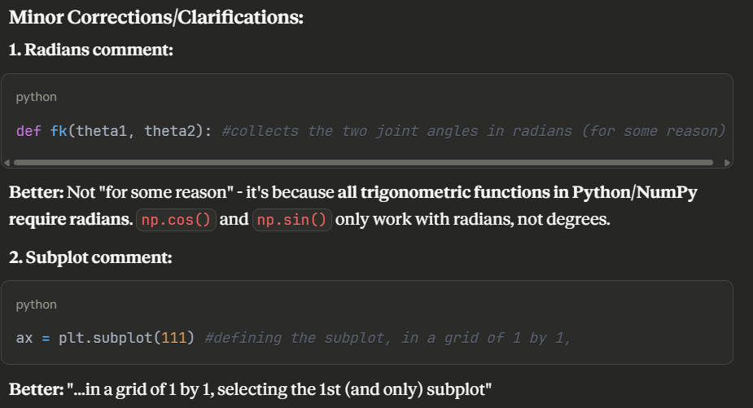
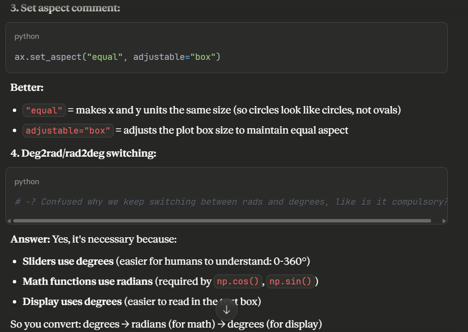

## 🔃 Installation
I already had vis studio and python installed

Installing the libraries to be included came with some "issues" however

after installing the libraries 

```bash
pip install numpy matplotlib
```

I received a notification stating that I did not have a virtual environment created for the project, so I decided to look into what that was, it's use and implementation.

After all that happened, I ended up going down the path of trying to find out an easier way to go through all that. 

Then I remembered what you said about installing the necessary extensions so I installed the Python extension, which came with various other extentions, one of which dealt with some of that virtual environment stuff (but at least now I kinda get a gist of all that).

    Question: for future python tasks, would you provide a "requirements.txt" file to quicken the installation process? 
    
    or is it even necessary? 
    
    and was all this virtual environment stuff discussed before in one of the classes? 
    
    (I wasn't really 100% present enough to know, if so, sorry)
 ---
 ---
## 📝 Learning process
 Went through a combination of
 - Youtube crash courses
 - Docs 
 - Ai explanations
 
 To basically get the gist of each line step by step, 
 
 (for python, matplotlib, tiny amount of numpy)

 ---
 ---
## 🤖 Self Assessment 
I might've done a bit of a self assessment to check out if the comments I wrote actually made sense 😅

So this what AI basically said that I used to get a bit more clarifiction on parts I got lost with:





Decided to leave the "original" comments in, for the sake of originality still