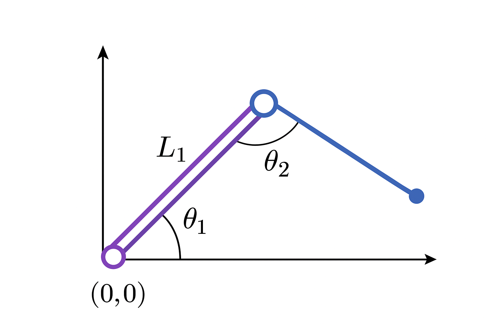

WHAT I LEARNED
2-link robot arm demo
- shows elbow-up and elbow-down positions
- click anywhere on the plot, it tries to reach the point
- shows joint angles in degrees
- uses simple 2R geometry (planar)

uses numpy for math and matplotlib for visuals

ik_2r(x, y): calculates both joint angle solutions for a given point
fk_2r(t1, t2): gets end-effector position from joint angles

if you click outside the reachable area, it shows "unreachable"

reach circles show max and min reach (L1+L2 and |L1-L2|)
R = L1 + L2
L1 = 1.5, L2 = 1.0

WHAT I DID
- added comments everywhere I could and made them clerer and easier to spot
- made slight changes to names because I revel in capitalization
- added np.clip to avoid sqrt errors because they are bound to happen with really small floating point rounding errors that computers get and you can end up with '1-c^2' being slightly negative
- added small readability changes
- legend and angles formatted nicely
- changed arm colours because why not

a simple picture I generated with chatgpt because I have no other visuals to offer:
